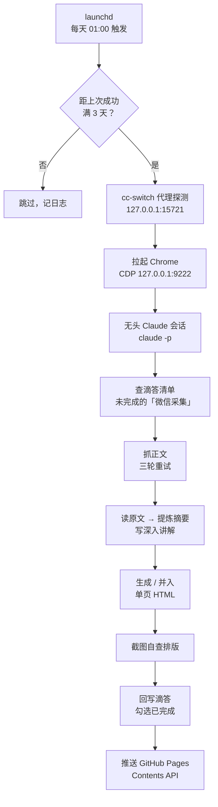

# 微信采集 → 单页学习站

> 一个跑在**凌晨 1 点**的自动化流水线：把我在滴答清单「微信采集」标签里攒的微信文章，
> 自动抓正文、提炼摘要、生成一页能离线读的学习站，再发布到这里。

**线上地址**：https://useralex110.github.io/reading-digest/

---

## 它做了什么



**关键点：中间那步是真的 AI 在跑，不是脚本在跑。** launchd 只是个闹钟；
被它唤醒的 `claude -p` 是一个完整的 Claude 会话——它自己决定先查什么、
抓失败了怎么换策略重试、读完全文后写什么摘要。摘要、分类、"三个范式转移"
这类内容全部是读完原文现写的，不是模板套的。

---

## 三条绕不开的约束

这三条都是**实测撞出来的**，每一条都能让整条流水线静默死掉。
写在这里，是因为以后想改东西时，不知道这些就会白折腾。

### 1. 项目必须待在 `~/code`，不能放 `~/Documents`

macOS 的 TCC 保护让 **launchd 启动的进程读不了 `~/Documents`**。实测表现很反直觉：

```
ls   ~/Documents/.../项目     → Operation not permitted
bash ~/Documents/.../脚本.sh  → Operation not permitted   ← 连执行都挡
touch ~/Documents/.../新文件  → OK                        ← 写入反而放行
```

**最阴的地方**：在终端里手动跑同一个脚本一切正常——终端自己持有授权，把问题盖住了。
只有让 launchd 真正拉起任务才暴露（退出码 126）。

所以项目现在在 `~/code/didaMind`。**别再搬回 `~/Documents`。**

### 2. 抓微信正文必须走真实浏览器

`curl` 带正常 UA 请求微信文章，会被 302 到验证页（`mp/wappoc_appmsgcaptcha`），
返回体里根本没有正文容器 `#js_content`。换成裸链接（只留 `__biz&mid&idx&sn`）也一样。

这不是 UA 问题，是服务端对无浏览器环境的拦截。所以抓取器直接驱动
Chrome DevTools 协议，并内置三轮重试：原链接 → 裸链接 → 裸链接+加长等待。

### 3. 部署走 GitHub Contents API，不能用 `git push`

这台机器上 `github.com:443` **不通**，但 `api.github.com` **通**。
所以任何 `git push` / `git clone` 都会失败，而 `gh api` 一切正常。

部署脚本用 `gh api -X PUT .../contents/...` 写文件，同样生成真实 commit。

---

## 怎么用

日常操作走 `wxdigest`：

```bash
wxdigest            # 状态：定时是否启用 / 上次成功 / 下次执行 / 线上地址
wxdigest run        # 立刻跑一次（尊重 3 天节流）
wxdigest now        # 强制跑一次（无视节流）
wxdigest log        # 最近一次运行的完整日志
wxdigest deplog     # 部署日志
wxdigest on | off   # 启用 / 停用定时任务
wxdigest open       # 打开本地成品 HTML
wxdigest site       # 打开线上站点
```

平时**什么都不用做**——在微信里往「微信采集」标签丢链接就行，剩下的它自己会处理。

---

## 要注意什么

**手动跑通 ≠ 定时任务没问题。** 改完必须让 launchd 真跑一次：

```bash
launchctl kickstart -p "gui/$(id -u)/com.didamind.wxdigest"
launchctl print "gui/$(id -u)/com.didamind.wxdigest" | grep -E 'last exit|runs'
```

`last exit code = 126` 就是权限被拒。改完 plist 要先 `bootout` 再 `bootstrap` 才生效。

**失败不会浪费那 3 天额度。** 只有 `claude` 退出码为 0 才写入"上次成功"时间戳——
代理挂了、Chrome 起不来、会话崩了，第二天都会自动重试。

**内容只能从原文提炼，不编造。** 原文没有的数字、结论、人名一律不写。
抓取失败的条目如实标注，并且**不勾选**对应的滴答任务，留到下次重试。

**只勾「微信采集」标签下的任务**，绝不碰其他标签。

---

## 我学到了什么

<!-- TODO(human) 用你自己的话写 3–5 条。提示（可以直接删掉）：
     · 这次最让你意外的"原来是这样"是什么？
     · 哪个坑是你觉得"换了我也想不到"的？
     · 关于「收藏 ≠ 学会」，这个项目有没有改变你的看法？
     · 如果重来一次，你会先做哪一步？
-->
laudnchd
claude code
githubpages

---

## 技术栈

macOS launchd · Bash · Node.js (Chrome DevTools Protocol) · Claude Code 无头模式 ·
滴答清单 MCP · GitHub Contents API · GitHub Pages
